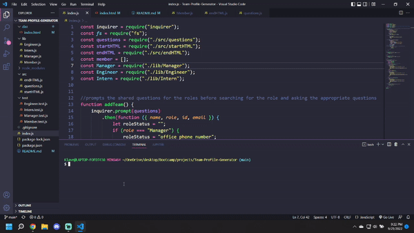

# Team-Profile-Generator

## Table of Contents

- [Team-Profile-Generator](#team-profile-generator)
  - [Table of Contents](#table-of-contents)
  - [Description](#description)
  - [Resources](#resources)
  - [Visuals](#visuals)
  - [Authors and Acknowledgments](#authors-and-acknowledgments)

## Description

The Challenge three assignment tasked us with creating a Team Profile Generator using Object Oriented Programming (OOP) as well as node.js, specifically inquirery and fs (filesystem).

This was accomplished by using lessons from the last two modules as well as class time from each class to implement a working command line prompt program where the user can enter an amount of team members with the specified and create a single page html to display the data.

## Resources

- [Repository](https://github.com/Jklaver91/Team-Profile-Generator)

## Visuals

## Authors and Acknowledgments

Code created by Justin Klaver.